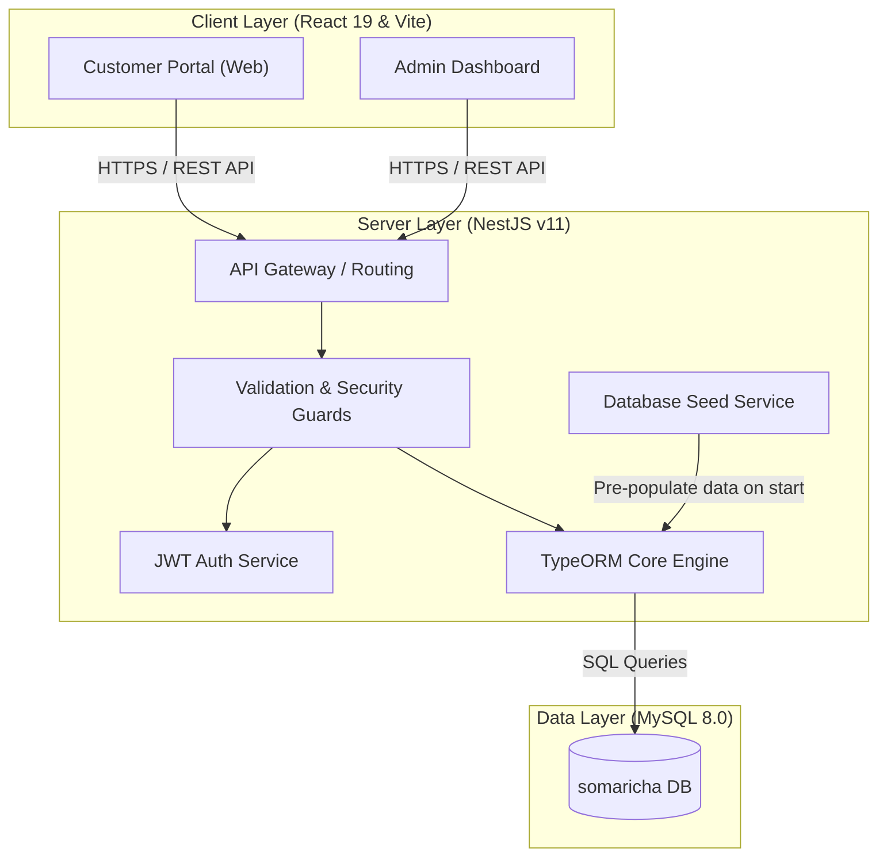

# 🍵 Somaricha (โสมาริชา)
> **Premium & Healthy Stevia-Sweetened Fruit Tea E-Commerce Platform**

Somaricha is a modern, full-stack, enterprise-grade e-commerce application designed specifically for a premium healthy beverage brand. The platform specializes in selling organic fruit teas sweetened naturally with 100% Japanese Stevia (หญ้าหวาน), catering to health-conscious consumers. 

The system features a **Customer Web Application** for browsing, ordering, and managing deliveries, alongside a comprehensive **Admin Dashboard** for sales analytics, order management, payment verification, product inventory, and system administration.

---

## 🏗️ System Architecture

Somaricha is built on a robust, decoupled three-tier architecture that is fully containerized using Docker.



---

## 🚀 Key Features

### 🛒 Customer Web Application
* **Interactive Menu & Catalog:** Explore premium fruit teas, including Peach Stevia Tea, Fresh Strawberry Tea, Kiwi Lemon Tea, Passion Fruit Honey Tea, and Mango Stevia Tea.
* **Smart Shopping Cart (Basket):** Seamless cart updates, pricing summaries, and checkout orchestration.
* **Delivery Address Management:** Save, edit, and organize multiple shipping locations (e.g., Home, Office) with custom address options.
* **Dynamic Payment Checkout:** Secure checkout flow with manual payment upload capability (receipt slip validation).
* **Order Tracking & History:** Real-time visibility into past orders, current order status, and detailed itemized receipts.
* **Interactive User Profiles:** Manage personal information, security credentials, and contact details.

### 📊 Admin Management Dashboard
* **Metrics Dashboard:** Real-time business performance indicators (revenue, pending orders, user growth).
* **Sales & Analytical Insights:** Visualized sales performance, monthly trends, and best-selling product charts powered by Recharts.
* **Order Fulfillment Center:** Manage lifecycle states of orders from "Pending" to "Preparing", "Shipping", and "Completed".
* **Payment Slip Verifier:** Review uploaded bank transfer receipt slips and approve or reject payments manually.
* **Product Inventory CRUD:** Add new beverages, update descriptions, adjust prices, edit images, and toggle stock availability.
* **Address Option Configuration:** Set up standard global shipping types and address labels.
* **User & Role Auditing:** Monitor register entries, user roles (Customer, Admin/Owner), and security profiles.

### 🛡️ Core Backend Securities
* **Rate Limiting:** Guarded by NestJS Throttler to prevent brute-force attacks and abuse.
* **Helmet Middleware:** Configured with secure HTTP headers for XSS, clickjacking, and frame-guard protection.
* **Input Validation & Sanitization:** Global `ValidationPipe` leveraging `class-validator` and `class-transformer` to filter incoming payloads.
* **Bearer Token JWT Auth:** Secure access management with route-level Passport JWT strategy guards.

---

## 🛠️ Technology Stack

### Frontend (Client)
* **Core Framework:** React 19 (TypeScript)
* **Build Tool:** Vite 7.1
* **Styling & Theme:** Tailwind CSS v4 (Sleek, fluid, responsive and dynamic interfaces) & Sass (`sass-embedded`)
* **Navigation:** React Router 7 (`react-router-dom`)
* **Data Fetching:** Axios (configured with interceptors for bearer authentication)
* **Visualization:** Recharts (high-performance SVGs for analytics)
* **Sliders & Carousels:** React Slick + Slick Carousel
* **Notifications:** React Toastify
* **Icons:** Lucide React & React Icons

### Backend (Server)
* **Core Framework:** NestJS v11 (TypeScript-first node framework)
* **ORM:** TypeORM v0.3 (Data mapper pattern with high database decoupling)
* **Database Driver:** `mysql2`
* **API Documentation:** OpenAPI Swagger UI (persistent authorizations enabled at `/api`)
* **Security:** Helmet, bcrypt (password hashing), passport-jwt
* **Validation:** class-validator & class-transformer

### DevOps & Infrastructure
* **Containerization:** Docker & Docker Compose
* **Web Server:** Nginx (used for production client hosting and reverse proxy)
* **Hosting Configurations:** Out-of-the-box configurations for Docker, local hosting, and Vercel

---

## 📂 Project Directory Structure

```text
somaricha/
├── client/                     # Frontend Client Module (Vite + React)
│   ├── src/
│   │   ├── assets/             # Brand logos, placeholder graphics
│   │   ├── components/         # Reusable UI inputs, layouts, spinners, custom scss
│   │   ├── contexts/           # Authentication state context
│   │   ├── hooks/              # Custom state hooks
│   │   ├── layouts/            # Global page templates (Web MainLayout & AdminLayout)
│   │   ├── pages/
│   │   │   ├── admin/          # Product CRUD, User list, Analytics, Order & Payment lists
│   │   │   ├── auth/           # Login and Register UI pages
│   │   │   └── web/            # Home, Cart, Orders, Payment, Addresses, Profile, FAQs
│   │   ├── services/           # Api client service layers (Auth, Products, Orders, etc.)
│   │   ├── App.tsx             # Route routing definitions
│   │   └── main.tsx            # Main frontend entry point
│   ├── Dockerfile              # Nginx multi-stage client build
│   └── package.json
│
├── server/                     # Backend API Module (NestJS)
│   ├── src/
│   │   ├── address/            # TypeORM entities, DTOs, controllers, services for Addresses
│   │   ├── address_option/     # Configuration module for address labels (Home, Work, etc.)
│   │   ├── auth/               # Passport authentication logic, JWT token issuance
│   │   ├── common/             # Interceptors (Logging, Response wrapping), Exception Filters
│   │   ├── health/             # Standard health check endpoint
│   │   ├── migrations/         # SQL database schema versions
│   │   ├── order/              # Orders and Order-Items transaction tables
│   │   ├── payment/            # Payment gateway mock and receipt slips reviewer
│   │   ├── product/            # Stevia tea beverage profiles management
│   │   ├── user/               # Customer and Owner/Admin profiles
│   │   ├── app.module.ts       # Global Application Module & Database orchestrator
│   │   ├── main.ts             # Bootstrapper (CORS, Pipes, Helmet, Swagger registration)
│   │   └── seeder.service.ts   # Auto-seeds healthy teas & mock users on clean db starts
│   ├── Dockerfile              # Node NestJS server build
│   └── package.json
│
└── docker-compose.yml          # Container orchestration (MySQL 8, NestJS API, React Web App)
```

---

## ⚙️ Environment Variables

Before launching the application, configure your environments. Create `.env` files in both standard module directories.

### Server Environment (`server/.env`)
```env
PORT=3000
DB_HOST=db                     # Use 'db' for Docker-Compose, 'localhost' for local development
DB_PORT=3306
DB_USERNAME=somaricha_user
DB_PASSWORD=somaricha_password
DB_DATABASE=somaricha
JWT_SECRET=super_secure_jwt_secret_key_123!
DB_SSL=false
```

### Client Environment (`client/.env`)
```env
VITE_API_URL=http://localhost:3000/api
```

---

## 🚀 Setup & Installation

### Option 1: Quick Start via Docker Compose (Recommended)
Make sure you have Docker installed. This command builds and sets up all components, databases, and migrations automatically:

```bash
# Build and run the entire ecosystem in the background
docker-compose up -d --build
```

Access the applications at:
* **Customer & Admin Portal:** [http://localhost](http://localhost) (exposed on port 80)
* **Backend REST API:** [http://localhost:3000](http://localhost:3000)
* **OpenAPI Swagger API Docs:** [http://localhost:3000/api](http://localhost:3000/api) (persists Bearer authentication token for easy testing!)

---

### Option 2: Running Locally for Development

#### 1. Setup the Database
Ensure a MySQL server is running locally on port `3306`. Create a database named `somaricha`:
```sql
CREATE DATABASE somaricha;
```

#### 2. Start the Backend API Server
```bash
cd server
npm install
npm run start:dev
```
*The server will boot on [http://localhost:3000](http://localhost:3000). On first launch, the `SeederService` will automatically detect a clean database and seed the system with default beverages, users, owner accounts, and addresses!*

#### 3. Start the Frontend React Client
```bash
cd client
npm install
npm run dev
```
*The frontend development server will launch on [http://localhost:5173](http://localhost:5173).*

---

## 🔑 Seeded Accounts (Mock Data)
On clean database runs, the system seeds the following credentials with the password `password123`:

* **Owner / Admin Account:**
  * **Username:** `owner`
  * **Email:** `owner@somaricha.com`
* **Customer / User Account:**
  * **Username:** `customer`
  * **Email:** `customer@somaricha.com`

---

## 🔄 Recent Enhancements
The system was recently updated with core UI and API improvements:
1. **Interactive Password Toggles:** Added absolute-positioned visual password eye icons (`FaEye`/`FaEyeSlash`) inside `Register.tsx` to toggle character readability.
2. **Aligned Register Schema:** Fixed integration mismatches between client payloads and the database schema by mapping `username`, `email`, `user_name` (First name), and `user_lastname` (Last name) precisely to backend expectations.

---

*For detailed revision logs and specific file updates, please refer to the [CHANGES.md](file:///Users/mac/Desktop/workspace/somaricha/CHANGES.md) document.*
